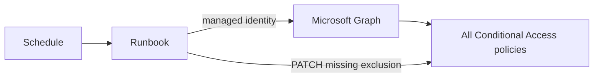
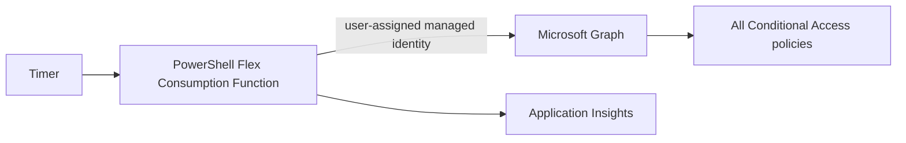
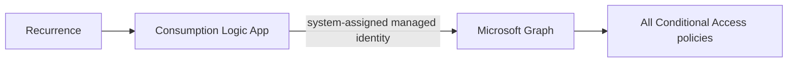
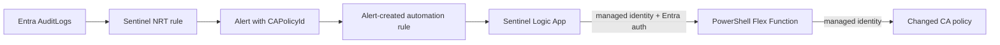

# Emergency access protection for Microsoft Entra

An [Azure Developer CLI](https://learn.microsoft.com/azure/developer/azure-developer-cli/) template that keeps a designated emergency-access group excluded from every Microsoft Entra Conditional Access policy. One azd environment deploys exactly one remediation mode.

> Emergency access is a last-resort control, not a substitute for tested identity recovery procedures. Follow Microsoft's [emergency access account guidance](https://learn.microsoft.com/entra/identity/role-based-access-control/security-emergency-access), monitor every sign-in, and validate these accounts regularly.

## Deployment modes

An azd environment is locked to its first successfully provisioned mode. Run `azd down` before changing `AZD_DEPLOYMENT_MODE`, or create a new azd environment; this prevents incremental ARM deployments from leaving the previous remediator active.

| `AZD_DEPLOYMENT_MODE` | Trigger | Work performed | Best fit |
| --- | --- | --- | --- |
| `automation-scheduled` | Azure Automation schedule | Enumerates all Conditional Access policies | PowerShell-oriented operations |
| `function-scheduled` | Azure Functions timer | Enumerates all Conditional Access policies | Serverless scheduled enforcement |
| `logicapp-scheduled` | Consumption Logic App recurrence | Enumerates all Conditional Access policies | Low-code operations |
| `sentinel-function` | Sentinel NRT alert and automation rule | Remediates only the changed policy | Tenants already ingesting Entra audit logs into Sentinel |

All Graph access uses managed identity. The template does not create a Key Vault, persist credentials, use storage account keys for Function runtime access, expose Function keys, or deploy Azure Monitor scheduled-query alerts.

## Quickstart

### Prerequisites

- An Azure subscription and Microsoft Entra tenant.
- [Azure Developer CLI](https://learn.microsoft.com/azure/developer/azure-developer-cli/install-azd), Azure CLI, PowerShell 7.4 or later, and Azure Functions Core Tools v4 for Function modes.
- Subscription Contributor plus User Access Administrator or Owner for Azure resources and role assignments.
- Microsoft Entra Global Administrator or Privileged Role Administrator for permanent Global Administrator assignments.
- Microsoft Graph delegated consent sufficient to create/read the selected tenant objects and assign Graph app roles. TAP configuration also requires authentication-method policy and user-authentication-method permissions.
- For `sentinel-function`, an existing Log Analytics workspace with Microsoft Sentinel enabled and Entra `AuditLogs` ingestion.

Initialize and select an environment:

```powershell
azd init --template nathanmcnulty/azd-emergency-access
azd env new emergency-protection
azd env set AZD_DEPLOYMENT_MODE function-scheduled
azd env set AZD_NON_INTERACTIVE true
azd env set AZD_EMERGENCY_DOMAIN contoso.onmicrosoft.com
azd provision --preview
azd up
```

The quickstart selects the scheduled Function mode as the recommended general-purpose option and disables prompts after setting every required value. Review the preview before approving production tenant changes. For interactive mode selection, omit `AZD_NON_INTERACTIVE` and `AZD_DEPLOYMENT_MODE`.

To preview later infrastructure changes before applying them:

```powershell
azd provision --preview
azd up
```

The preprovision hook prompts for a mode when a terminal is interactive. CI and other noninteractive runs must set every required value explicitly.

### Reuse existing emergency identities

Each existing object is independent. Supply any combination; only missing objects are created.

```powershell
azd env set AZD_EMERGENCY_USER1_ID 11111111-1111-1111-1111-111111111111
azd env set AZD_EMERGENCY_USER2_UPN emergency2@contoso.onmicrosoft.com
azd env set AZD_EMERGENCY_GROUP_ID 22222222-2222-2222-2222-222222222222
azd env set AZD_ADMINISTRATIVE_UNIT_ID 33333333-3333-3333-3333-333333333333
azd up
```

If a user must be created, a cryptographically random initial password is generated only to satisfy Microsoft Graph, then immediately discarded. It is never printed, returned, stored in azd state, written to a file, logged, or placed in Key Vault. **Password recovery/output is intentionally impossible.** Use TAP onboarding to establish passkeys.

### Sentinel mode

```powershell
azd env set AZD_DEPLOYMENT_MODE sentinel-function
azd env set AZD_SENTINEL_WORKSPACE_NAME law-security
azd env set AZD_SENTINEL_WORKSPACE_RESOURCE_GROUP rg-security
azd env set AZD_EMERGENCY_GROUP_ID 22222222-2222-2222-2222-222222222222
azd provision --preview
azd up
```

The workspace must already be Sentinel-enabled. The template deploys an NRT analytics rule, one alert per result, no incidents, an alert-created automation rule, and a minimal Sentinel playbook. The playbook calls the targeted remediation Function through its managed identity. The hook creates a tenant-local API application with the stable `api://<appId>` audience and an `EmergencyAccess.Remediate` application role, then grants that role to the playbook managed identity. App Service Authentication validates that audience and restricts callers to the playbook principal. The Function binding is `anonymous` only so Easy Auth, rather than a Function key, is the sole request authenticator. No client secret is created.

## Architecture

### Azure Automation



### Scheduled Function



### Scheduled Logic App



### Sentinel-targeted Function



The NRT query detects successful policy additions/updates, ignores the remediation identity to avoid loops, and exposes `CAPolicyId` as a custom detail:

```kusto
AuditLogs
| where Result =~ "success"
| where OperationName in ("Add conditional access policy", "Update conditional access policy")
| where Identity != "<remediation identity/name>"
| extend CAPolicyId = tostring(todynamic(TargetResources)[0].id), ActorIdentity = Identity
| where isnotempty(CAPolicyId)
| project TimeGenerated, CAPolicyId, OperationName, ActorIdentity, CorrelationId
```

## Environment variables

| Variable | Default | Required | Purpose |
| --- | --- | --- | --- |
| `AZD_DEPLOYMENT_MODE` | none | Always | One of the four mode names above |
| `AZURE_LOCATION` | `westus2` | Always | Resource deployment region |
| `AZD_EMERGENCY_DOMAIN` | none | When creating users | Verified tenant domain used for generated UPNs |
| `AZD_EMERGENCY_USER1_ID` / `AZD_EMERGENCY_USER2_ID` | none | No | Existing user object IDs |
| `AZD_EMERGENCY_USER1_UPN` / `AZD_EMERGENCY_USER2_UPN` | none | No | Existing UPNs; resolved IDs are persisted |
| `AZD_EMERGENCY_GROUP_ID` | none | No | Existing security-group object ID |
| `AZD_ADMINISTRATIVE_UNIT_ID` | none | No | Existing administrative-unit object ID |
| `AZD_USE_RESTRICTED_AU` | `true` | Always | Create/use a restricted management AU; set `false` to skip |
| `AZD_ENABLE_TAP_POLICY` | `false` | Always | Enable/configure TAP and create reusable TAPs |
| `AZD_SCHEDULE_CRON` | `0 0 */6 * * *` | Function mode | Six-field NCRONTAB timer schedule |
| `AZD_SCHEDULE_INTERVAL` | `6` | Automation/Logic App | Positive recurrence interval |
| `AZD_SCHEDULE_FREQUENCY` | `Hour` | Automation/Logic App | `Minute`, `Hour`, `Day`, `Week`, or `Month` |
| `AZD_AUTOMATION_TIME_ZONE` | `Etc/UTC` | Automation | Automation schedule timezone |
| `AZD_SENTINEL_WORKSPACE_NAME` | none | Sentinel | Existing Sentinel workspace |
| `AZD_SENTINEL_WORKSPACE_RESOURCE_GROUP` | none | Sentinel | Existing workspace resource group |
| `AZD_FUNCTION_AUTH_CLIENT_ID` | created | Sentinel | Optional existing API app client ID; normally hook-managed |
| `AZD_FUNCTION_AUTH_AUDIENCE` | `api://<appId>` | Sentinel with existing app | Resolvable API application ID URI |
| `AZD_RESOURCE_NAME_PREFIX` | environment-derived | No | Optional deterministic naming prefix |
| `AZD_NON_INTERACTIVE` | `false` | CI | Set `true` to disable prompts |

The deployment records non-secret resolved object IDs and exact `AZD_OWNED_*_ID` ownership records in the azd environment for idempotency and safe cleanup. It refuses to replace an exact-owned privileged object until that object is explicitly cleaned up, preventing an old emergency account or API app from being stranded. Cleanup requires the current configured ID to exactly match the recorded created ID. Passwords and TAP values are never persisted.

## Identity bootstrap and permissions

The preprovision hook resolves the tenant identities needed by ARM configuration, and the postprovision hook grants workload permissions and performs optional TAP onboarding. The idempotent hooks use the deployer's Microsoft Graph token to:

1. Resolve or create two cloud-only users.
2. Resolve or create a security group and add both users.
3. Create/use a restricted management administrative unit by default and add the users/group.
4. Assign permanent Global Administrator to both users.
5. Grant the remediation workload identity `Policy.Read.All`, `Policy.ReadWrite.ConditionalAccess`, and `Application.Read.All`. The last permission is the documented higher-privilege workaround for the current Conditional Access PATCH permissions issue.
6. Optionally configure TAP and issue reusable two-hour passes.

A restricted management AU limits management by many delegated administrators, but **Global Administrators can still manage restricted objects**. Keep emergency accounts cloud-only, exclude them only as intended, alert on all activity, and separate credentials/devices from ordinary administration.

Sentinel also requires its **Azure Security Insights** automation service identity to have **Microsoft Sentinel Automation Contributor** at the playbook resource-group scope. The postprovision hook assigns this when the tenant service principal is available. If propagation or permissions block it, use **Microsoft Sentinel > Settings > Playbook permissions** to grant access to the resource group printed by the hook.

## TAP and passkey onboarding

When TAP policy enablement is requested, bootstrap merges the emergency group into the existing `includeTargets` collection and leaves exclusions and unrelated policy settings unchanged.

`AZD_ENABLE_TAP_POLICY` defaults to `false`. An interactive deployment prompts before changing the tenant authentication-method policy. A noninteractive deployment silently skips TAP unless the value is explicitly `true`.

When enabled, each reusable TAP has a lifetime of exactly 120 minutes and is displayed once in the interactive console. It is not recoverable from this project. Immediately:

1. Sign in as each emergency user with its TAP.
2. Register at least two passkeys for each account.
3. Test each passkey from the documented emergency workstation/process.
4. Remove obsolete authentication methods according to policy.

Delegated consent can cause HTTP 403 even when the operator is Global Administrator. TAP failures are nonfatal to core Azure provisioning. Grant the required Microsoft Graph delegated permissions/admin consent, enable Temporary Access Pass for the emergency group, manually create a reusable two-hour TAP for each account, and register at least two passkeys per account.

## Remediation behavior and idempotency

The shared PowerShell core validates GUIDs, reads authoritative policy state, preserves and deduplicates all existing `excludeGroups`, and sends PATCH only when the emergency group is missing. Scheduled modes enumerate the policy collection. Sentinel mode retrieves only the supplied `CAPolicyId`. Results include evaluated, updated, unchanged, and failed counts plus policy IDs; any Graph update failure returns structured failure data and a failing invocation.

Rerunning `azd up` reuses tenant IDs persisted in the current azd environment, preserves existing Azure resources, and repeats role/app-role assignments only when absent.

## Verification

1. Create or update a test Conditional Access policy without the emergency group exclusion. Keep it in report-only mode and scope it safely.
2. Trigger the selected schedule/runbook, or wait for the Sentinel NRT alert.
3. Confirm the group is appended to `conditions.users.excludeGroups` and all prior exclusions remain.
4. Run remediation again and confirm zero PATCH operations.
5. Review Automation jobs, Function logs/Application Insights, Logic App run history, or Sentinel automation-rule runs.
6. Test both emergency users and both passkeys per user through the documented recovery procedure.

Run repository validation:

```powershell
Invoke-Pester ./tests
az bicep build --file ./infra/main.bicep
azd config show
```

## CI and noninteractive use

Set `AZD_NON_INTERACTIVE=true`, provide the mode and all mode-specific values, and authenticate Azure CLI/azd using workload identity federation. Tenant bootstrap requires a Microsoft Graph token with the documented application/delegated permissions; do not use a client secret. TAP remains off unless explicitly enabled. If enabled noninteractively, the policy is configured but TAP methods are not generated because their one-time values cannot be safely delivered through CI; create them interactively afterward.

## azd catalog publishing

The repository-owned website metadata is in [`.azd/catalog.json`](.azd/catalog.json). Changes to that file or its catalog inputs on `main` trigger [the catalog publishing workflow](.github/workflows/publish-azd-catalog.yml), which sends an `azd-catalog-updated` repository dispatch to `nathanmcnulty/azd-website`. Maintainers can also run the workflow manually.

Configure the `AZD_CATALOG_TOKEN` repository Actions secret with a fine-grained personal access token that can send repository dispatches to `nathanmcnulty/azd-website` (repository **Contents: Read and write**). When the secret is absent, the workflow succeeds without dispatching and emits a clear notice.

## Cleanup

Delete Azure resources for the active environment:

```powershell
azd down --purge --force
```

Before the primary resource group is removed, the noninteractive `predown` hook validates and deletes this environment's exact recorded Sentinel analytics/automation rule IDs from the external workspace resource group. It also deletes only the exact environment-owned Function API application/service principal. A supplied API application is never deleted. Failure to validate ownership stops `azd down` rather than broadening deletion.

Normal Azure cleanup intentionally does not delete emergency tenant identities. To delete only tenant objects whose exact current IDs match exact created-ID ownership records:

```powershell
./scripts/Remove-TenantObjects.ps1 -DeleteObjectsCreatedByThisEnvironment
```

PowerShell confirmation is required. Review the resolved and owned IDs first. The script never deletes supplied existing objects, mismatched IDs, unrelated workspaces, or untracked tenant objects. Remove permanent role assignments and authentication methods according to your change process before or after deletion as required.

## Troubleshooting

- **Preprovision rejects an input:** correct the named environment variable; validation intentionally fails before Azure changes.
- **Graph HTTP 403:** confirm the signed-in tenant, active Entra role, Graph delegated consent, and privilege elevation. Azure RBAC Owner does not grant Microsoft Graph privileges.
- **Function returns 401/403:** confirm the playbook uses managed identity, Easy Auth is enabled, and its principal is authorized for the Function application.
- **Sentinel automation does not run:** confirm Sentinel onboarding, `AuditLogs` ingestion, NRT rule health, Automation Contributor at playbook RG scope, and the automation rule's analytics-rule condition.
- **No Function deployment:** install Azure Functions Core Tools v4 and rerun `azd deploy`/`azd up`.
- **TAP 403:** use the manual fallback in the TAP section; core remediation remains deployable.

## Security limitations

- Permanent Global Administrator is intentionally powerful. Use exactly two purpose-built cloud-only accounts and monitor them.
- Conditional Access exclusion protects recoverability but removes controls represented by the excluded policies. Compensate with phishing-resistant credentials, secured devices/processes, and alerting.
- Scheduled modes can leave a gap until their next run. Sentinel mode depends on prompt audit-log ingestion and healthy Sentinel automation.
- This template cannot validate organizational approval, physical credential custody, or recovery drills.

## Roadmap

- **TODO:** Add an optional Azure Monitor scheduled-query-alert implementation for tenants that do not use Sentinel. No Azure Monitor alert resource is deployed today.

## References

- [Manage emergency access accounts in Microsoft Entra ID](https://learn.microsoft.com/entra/identity/role-based-access-control/security-emergency-access)
- [Temporary Access Pass](https://learn.microsoft.com/entra/identity/authentication/howto-authentication-temporary-access-pass)
- [PowerShell developer reference for Azure Functions](https://learn.microsoft.com/azure/azure-functions/functions-reference-powershell)
- [Flex Consumption plan](https://learn.microsoft.com/azure/azure-functions/flex-consumption-plan)
- [Microsoft Sentinel NRT analytics rules](https://learn.microsoft.com/azure/sentinel/create-nrt-rules)
- [Microsoft Sentinel automation rules](https://learn.microsoft.com/azure/sentinel/create-manage-use-automation-rules)
- [Azure Developer CLI template schema](https://learn.microsoft.com/azure/developer/azure-developer-cli/azd-schema)

## License

Released into the public domain under the [Unlicense](LICENSE).
