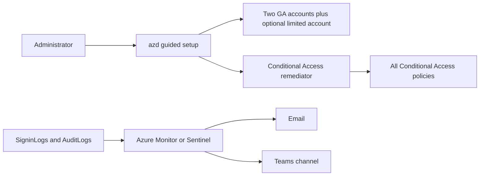

# Emergency access protection for Microsoft Entra

Deploy and protect Microsoft Entra emergency access accounts with a guided Azure Developer CLI experience.

This template helps an administrator:

1. Create or reuse two cloud-only emergency accounts.
2. Optionally add a third, lower-privilege recovery account.
3. Place them in a dedicated group and keep it excluded from every Conditional Access policy.
4. Alert by email, Microsoft Sentinel, and Microsoft Teams when the accounts are used.
5. Onboard phishing-resistant passkeys with Temporary Access Pass (TAP).
6. Revoke onboarding sessions before assigning permanent administrator roles.

> Emergency access accounts are a last-resort control. Follow [Microsoft's emergency access guidance](https://learn.microsoft.com/entra/identity/role-based-access-control/security-emergency-access), protect the credentials and devices, and test the complete recovery process regularly.

## Quickstart

### Before you begin

Install:

- [Azure Developer CLI](https://learn.microsoft.com/azure/developer/azure-developer-cli/install-azd)
- [Azure CLI](https://learn.microsoft.com/cli/azure/install-azure-cli)
- PowerShell 7.4 or later
- Microsoft Graph authentication for PowerShell:

```powershell
Install-Module Microsoft.Graph.Authentication -Scope CurrentUser
```

Use an administrator who can deploy Azure resources, create role assignments, prepare the emergency accounts, and grant the Microsoft Graph consent selected by the wizard. See [identity and permissions](docs/identity-and-authentication.md) before using this in production.

Email and Teams alerting require Entra `SigninLogs` and `AuditLogs` to already flow to Log Analytics or Microsoft Sentinel. The wizard lets you configure alerting later if those prerequisites are not ready.

`azd up` reuses the existing `azd`, Azure CLI, and Microsoft Graph caches. When a cache is missing, the normal operating-system or browser sign-in opens once. No device-code flow is used.

### Deploy

Run:

```powershell
azd init --template nathanmcnulty/azd-emergency-access
azd up
```

The first `azd up` walks through:

- the remediation service, with a scheduled Azure Function recommended for most organizations;
- creating, reusing, or externally managing the emergency identities;
- optional restricted management protection for the accounts and group;
- an optional limited recovery account for Conditional Access and authentication-policy lockouts;
- optional TAP and passkey onboarding;
- Azure Monitor email, Sentinel and Teams, both notification paths, or later configuration;
- normal Azure and Microsoft Graph browser consent.

Press Enter to accept choices marked `[default]`. The wizard reprompts invalid input and shows a final review before any tenant or Azure resources are changed. The choices are saved in the azd environment, so rerunning `azd up` is non-destructive and does not repeat a completed setup wizard. An interrupted wizard resumes on the next interactive run. Device-code authentication is never used.

### Finish account onboarding

If TAP onboarding was selected, each TAP is displayed exactly once. The deployment pauses while the custodians register passkeys, verifies that each account has a passkey, deletes the temporary passes, revokes the onboarding sessions, and only then assigns roles. Before closing the terminal:

1. Securely give each TAP to its intended custodian.
2. Sign in as each emergency account and register at least two passkeys.
3. Test both accounts through the documented recovery procedure.
4. Confirm the selected email and Teams notifications arrive.
5. Store credentials and recovery devices separately from normal administrator credentials.

Do not consider the deployment complete until both accounts and the notification path have been tested.

## What gets deployed



Only one remediation mode is deployed per azd environment. All runtime access to Microsoft Graph uses managed identity. The template does not store account passwords, TAP values, client secrets, Function keys, or storage keys.

## Choose an alerting path

| Experience | What the administrator receives | Prerequisite |
| --- | --- | --- |
| Azure Monitor | Critical email for successful or failed emergency-account sign-ins | `SigninLogs` in Log Analytics |
| Microsoft Sentinel | Incidents for sign-ins, activity performed by the accounts, and changes to the accounts | `SigninLogs` and `AuditLogs` in Sentinel |
| Sentinel plus Teams | Sentinel incidents posted to a selected Teams channel | Sentinel prerequisites and one browser authorization |
| Both | Independent Azure Monitor email and Sentinel/Teams notifications | Both sets of prerequisites |

The guided Teams option asks for a copied Teams channel link, creates the connection, prints one consent link, and enables the playbook after authorization. A webhook and a pre-authorized API connection remain available for advanced environments.

## Documentation

| Guide | Use it for |
| --- | --- |
| [Deployment modes](docs/deployment-modes.md) | Choosing the remediation service and understanding its architecture |
| [Identity and authentication](docs/identity-and-authentication.md) | Accounts, permissions, Graph consent, TAP, and passkeys |
| [Conditional Access remediation](docs/conditional-access-remediation.md) | Policy behavior, safety controls, and idempotency |
| [Alerting and notifications](docs/alerting-and-notifications.md) | Azure Monitor, Sentinel, email, Teams, and audit coverage |
| [Configuration reference](docs/configuration.md) | Environment variables, existing identities, and automation |
| [Operations](docs/operations.md) | Verification, troubleshooting, maintenance, and cleanup |
| [Development and publishing](docs/development.md) | Repository validation, generated templates, and catalog updates |

## Cleanup

Remove Azure resources and exact-owned external Sentinel resources:

```powershell
azd down --purge --force
```

Emergency tenant identities are intentionally retained. If this environment created them and deletion is explicitly approved, follow the ownership-aware process in [operations](docs/operations.md#remove-tenant-identities).

## Security

Permanent administrator roles and Conditional Access exclusions are intentionally powerful. Maintain at least two purpose-built cloud-only Global Administrator accounts, phishing-resistant authentication, independent monitoring, protected recovery devices, and regular drills. The optional limited account supplements those two; it does not replace either one. Review the [security model](docs/identity-and-authentication.md#security-boundaries) and report vulnerabilities through [SECURITY.md](SECURITY.md).

Released into the public domain under the [Unlicense](LICENSE).
