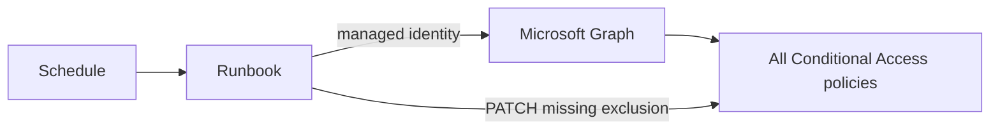
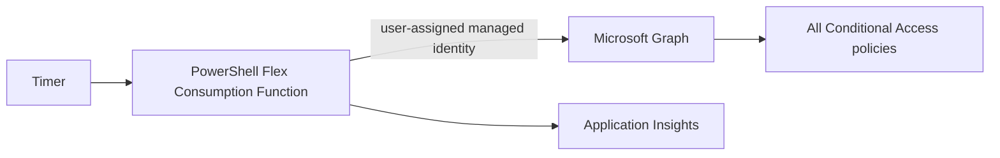
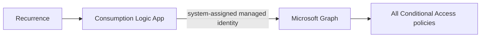
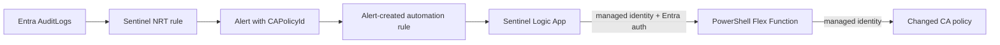
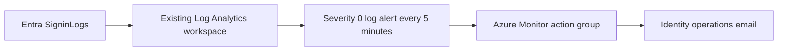
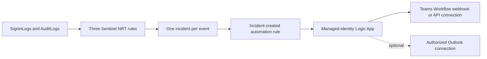

# Emergency access protection for Microsoft Entra

An [Azure Developer CLI](https://learn.microsoft.com/azure/developer/azure-developer-cli/) template that keeps a designated emergency-access group excluded from every Microsoft Entra Conditional Access policy. One azd environment deploys exactly one remediation mode.

> Emergency access is a last-resort control, not a substitute for tested identity recovery procedures. Follow Microsoft's [emergency access account guidance](https://learn.microsoft.com/entra/identity/role-based-access-control/security-emergency-access), monitor every sign-in, and validate these accounts regularly.

## Deployment modes

An azd environment is locked to its first successfully provisioned mode. Use a separate azd environment for each deployment mode. If an environment must be repurposed, run `azd down` successfully before changing `AZD_DEPLOYMENT_MODE`; never change the mode in place, because incremental ARM deployments can leave the previous remediator active.

| `AZD_DEPLOYMENT_MODE` | Trigger | Work performed | Best fit |
| --- | --- | --- | --- |
| `automation-scheduled` | Azure Automation schedule | Enumerates all Conditional Access policies | PowerShell-oriented operations |
| `function-scheduled` | Azure Functions timer | Enumerates all Conditional Access policies | Serverless scheduled enforcement |
| `logicapp-scheduled` | Consumption Logic App recurrence | Enumerates all Conditional Access policies | Low-code operations |
| `sentinel-function` | Sentinel NRT alert and automation rule | Remediates only the changed policy | Tenants already ingesting Entra audit logs into Sentinel |

All Graph access uses managed identity. The template does not create a Key Vault, persist credentials, use storage account keys for Function runtime access, or expose Function keys. Optional sign-in alerting uses Azure Monitor and has no access to Microsoft Graph credentials.

## Quickstart

### Prerequisites

- An Azure subscription and Microsoft Entra tenant.
- [Azure Developer CLI](https://learn.microsoft.com/azure/developer/azure-developer-cli/install-azd), Azure CLI, PowerShell 7.4 or later, and Azure Functions Core Tools v4 for Function modes.
- Subscription Contributor plus User Access Administrator or Owner for Azure resources and role assignments.
- Microsoft Entra Global Administrator or Privileged Role Administrator for permanent Global Administrator assignments.
- Microsoft Graph delegated consent sufficient to create/read the selected tenant objects and assign Graph app roles. TAP configuration also requires authentication-method policy and user-authentication-method permissions.
- For `sentinel-function`, an existing Log Analytics workspace with Microsoft Sentinel enabled and Entra `AuditLogs` ingestion.
- For optional Azure Monitor sign-in alerting, an existing Log Analytics workspace receiving the tenant's Entra `SigninLogs` and an email address for notifications.
- For optional Sentinel activity alerting, an existing Sentinel-enabled workspace receiving both `SigninLogs` and `AuditLogs`, plus either a Microsoft Teams Workflow webhook or an authorized Teams Logic Apps API connection. Optional playbook email requires an existing authorized Office 365 Outlook Logic Apps connection in the deployment region.
- A workspace may be in another subscription, but it must be in the same Entra tenant and the deployer must have the required read, deployment, and role-assignment permissions in that subscription and workspace resource group.

Initialize and select an environment:

```powershell
azd init --template nathanmcnulty/azd-emergency-access
azd env new emergency-protection
azd env set AZD_DEPLOYMENT_MODE function-scheduled
azd env set AZD_NON_INTERACTIVE true
azd env set AZD_EMERGENCY_DOMAIN contoso.onmicrosoft.com
azd hooks run preprovision
azd provision --preview
azd up
```

The quickstart selects the scheduled Function mode as the recommended general-purpose option and disables prompts after setting every required value. A first-run `azd provision --preview` does not execute project hooks, so run the preprovision hook explicitly first when IDs still need to be resolved or created. That hook can create privileged tenant identities and the emergency-access group; review its scope before running it. ARM deployment remains fail-closed if a resolved group ID is absent. Review the infrastructure preview before `azd up`. For interactive mode selection, omit `AZD_NON_INTERACTIVE` and `AZD_DEPLOYMENT_MODE`.

To preview later infrastructure changes before applying them:

```powershell
azd provision --preview
azd up
```

The preprovision hook prompts for a mode when a terminal is interactive. CI and other noninteractive runs must set every required value explicitly.

### Reuse existing emergency identities

Each existing object is independent. Supply any combination; only missing objects are created.

```powershell
azd env set AZD_EMERGENCY_USER1_ID 11111111-1111-1111-1111-111111111111
azd env set AZD_EMERGENCY_USER2_UPN emergency2@contoso.onmicrosoft.com
azd env set AZD_EMERGENCY_GROUP_ID 22222222-2222-2222-2222-222222222222
azd env set AZD_ADMINISTRATIVE_UNIT_ID 33333333-3333-3333-3333-333333333333
azd up
```

If a user must be created, a cryptographically random initial password is generated only to satisfy Microsoft Graph, then immediately discarded. It is never printed, returned, stored in azd state, written to a file, logged, or placed in Key Vault. **Password recovery/output is intentionally impossible.** Use TAP onboarding to establish passkeys.

### Sentinel mode

```powershell
azd env set AZD_DEPLOYMENT_MODE sentinel-function
azd env set AZD_SENTINEL_WORKSPACE_NAME law-security
azd env set AZD_SENTINEL_WORKSPACE_RESOURCE_GROUP rg-security
azd env set AZD_SENTINEL_WORKSPACE_SUBSCRIPTION_ID 00000000-0000-0000-0000-000000000000 # optional, same tenant
azd env set AZD_EMERGENCY_GROUP_ID 22222222-2222-2222-2222-222222222222
azd hooks run preprovision
azd provision --preview
azd up
```

The workspace must already be Sentinel-enabled. The template deploys an NRT analytics rule, one alert per result, no incidents, an alert-created automation rule, and a minimal Sentinel playbook. The playbook calls the targeted remediation Function through its managed identity. The hook creates a tenant-local API application with the stable `api://<appId>` audience and an `EmergencyAccess.Remediate` application role, then grants that role to the playbook managed identity. App Service Authentication validates that audience and restricts callers to the playbook principal. The Function binding is `anonymous` only so Easy Auth, rather than a Function key, is the sole request authenticator. No client secret is created. Re-run the Sentinel verification flow after changes to Microsoft Sentinel analytics/automation APIs, the Sentinel Logic Apps connector, or the Function authentication configuration.

### Optional emergency sign-in alerts

Enable this capability with any deployment mode when Entra sign-in logs already flow to a Log Analytics workspace:

```powershell
azd env set AZD_ENABLE_SIGNIN_ALERTS true
azd env set AZD_SIGNIN_LOG_WORKSPACE_NAME law-security
azd env set AZD_SIGNIN_LOG_WORKSPACE_RESOURCE_GROUP rg-security
azd env set AZD_SIGNIN_LOG_WORKSPACE_SUBSCRIPTION_ID 00000000-0000-0000-0000-000000000000 # optional, same tenant
azd env set AZD_SIGNIN_ALERT_EMAIL identity-operations@contoso.com
azd hooks run preprovision
azd provision --preview
azd up
```

To leave identity lifecycle entirely with an external process, supply the existing group ID and disable identity management. The template then does not create or modify emergency users, group membership, Global Administrator assignments, the restricted administrative unit, or TAP configuration. Sign-in or Sentinel activity alerting additionally requires both user object IDs. The deployment still grants the selected workload the Microsoft Graph application roles needed to remediate Conditional Access policies; Sentinel Function mode may also create or configure its authentication application.

```powershell
azd env set AZD_MANAGE_EMERGENCY_IDENTITIES false
azd env set AZD_EMERGENCY_GROUP_ID 22222222-2222-2222-2222-222222222222
azd env set AZD_EMERGENCY_USER1_ID 11111111-1111-1111-1111-111111111111 # required with alerting
azd env set AZD_EMERGENCY_USER2_ID 44444444-4444-4444-4444-444444444444 # required with alerting
azd up
```

In `sentinel-function` mode, the sign-in workspace name, resource group, and subscription default to the configured Sentinel workspace, so only the enable flag and email are additional. The workspace must ingest the tenant's `SigninLogs`; this template intentionally does not change tenant diagnostic settings or log retention. Deployment query validation fails closed if the table is unavailable.

The deployment creates a severity-0 Azure Monitor scheduled-query alert and an email action group in the azd environment's resource group. The alert resource uses the workspace's Azure region. Every five minutes, it searches a one-hour event-time range but selects only records ingested during the preceding five minutes; this accommodates normal ingestion delay without repeatedly alerting on the same record. It matches successful or failed sign-in attempts by either resolved emergency-user object ID. Failed attempts are included because they can reveal misuse even when no login succeeds. The rule is stateless (`autoMitigate: false`), so a later evaluation can notify again rather than remaining suppressed behind an unresolved emergency alert. Azure Monitor groups records found in the same evaluation into one alert notification.

### Optional Sentinel activity alerts and Teams notifications

This independent capability works with any remediation mode. It creates three Sentinel NRT analytics rules and an incident-triggered notification playbook:

- Every successful or failed interactive sign-in by either emergency account.
- Every Entra audit event initiated by either emergency account, preserving the operation, result, service, and correlation ID for investigation.
- Every Entra audit event that names either emergency account as a target, including credential, role, permission, or account changes made by someone else.

Each matching event creates its own high-severity Sentinel alert and incident. An incident-created automation rule invokes a managed-identity playbook, which posts through the selected Teams delivery method. This keeps SOC incident history and Teams delivery separate from the Azure Monitor action-group path.

The default interactive setup uses a Teams Logic Apps API connection and guides the administrator through its one required browser authorization:

1. In Teams, right-click the destination channel and select **Copy link**.
2. Run `azd up` and paste that link when prompted. The hook derives the tenant, team, and channel IDs.
3. The deployment creates the Teams connection and opens Microsoft's authorization page in the normal browser.
4. Sign in once as the durable notification account that should appear as the message sender, then return to the terminal and press Enter.
5. The hook verifies the connection, enables the playbook, and the optional delivery smoke test verifies a real channel post.

```powershell
azd env set AZD_ENABLE_SENTINEL_ACTIVITY_ALERTS true
azd env set AZD_SENTINEL_WORKSPACE_NAME law-security
azd env set AZD_SENTINEL_WORKSPACE_RESOURCE_GROUP rg-security
azd env set AZD_SENTINEL_WORKSPACE_SUBSCRIPTION_ID 00000000-0000-0000-0000-000000000000 # optional, same tenant
azd hooks run preprovision
azd provision --preview
azd up
```

This is user authorization of the Teams connector, not a tenant-wide Microsoft Graph permission grant. Use a dedicated, durable notification account with access to the destination channel rather than an emergency account or an administrator's everyday identity. The connector posts as that account, and its authorization must be renewed if that account's tokens are revoked.

To send one labeled test notification after deployment and fail `azd up` when the actual Teams or optional Outlook action fails, enable the delivery smoke test. It is off by default so routine deployments do not post messages:

```powershell
azd env set AZD_TEST_SENTINEL_NOTIFICATION_DELIVERY true
azd up
```

An API connection can continue to report `Connected` after its delegated refresh token has been revoked or expired. The live smoke test is the authoritative delivery check; resource status alone is not.

To reuse an existing authorized Teams Logic Apps connection instead of the guided flow, provide the connection and target IDs explicitly. The connection must use the Teams managed API in `AZURE_LOCATION` and the same Azure subscription:

```powershell
azd env set AZD_SENTINEL_TEAMS_DELIVERY_MODE api-connection
azd env set AZD_SENTINEL_TEAMS_CONNECTION_RESOURCE_ID '/subscriptions/<subscription>/resourceGroups/<resource-group>/providers/Microsoft.Web/connections/<connection>'
azd env set AZD_SENTINEL_TEAMS_TEAM_ID '<team ID>'
azd env set AZD_SENTINEL_TEAMS_CHANNEL_ID '<channel ID>'
```

For unattended deployment, provide the copied channel link and keep the default `admin-configured` mode. The deployment leaves the playbook disabled and prints the consent URL for a Teams administrator:

```powershell
azd env set AZD_SENTINEL_TEAMS_DELIVERY_MODE admin-configured
azd env set AZD_SENTINEL_TEAMS_CHANNEL_LINK '<copied Teams channel link>'
azd up
```

An administrator opens the printed consent URL and authorizes the connection, then reruns `azd hooks run postprovision`. No delivery-mode change or second infrastructure deployment is required.

If policy prohibits a user-authorized Azure API connection, `workflow-webhook` remains available. Create a Teams Workflow using **When a Teams webhook request is received**, assign durable owners, add the channel-posting action, and store its callback URL as `AZD_SENTINEL_TEAMS_WEBHOOK_URL`. The playbook calls that URL without acquiring a user token, but the URL is a bearer secret and the Teams Workflow still has an owner lifecycle.

The Sentinel playbook can also send high-importance email through an existing, authorized Office 365 Outlook API connection. Supply both values or neither:

```powershell
azd env set AZD_SENTINEL_OUTLOOK_CONNECTION_RESOURCE_ID '/subscriptions/<subscription>/resourceGroups/<resource-group>/providers/Microsoft.Web/connections/<connection>'
azd env set AZD_SENTINEL_NOTIFICATION_EMAIL identity-operations@contoso.com
```

The connection must be in `AZURE_LOCATION` and report an authorized status. This template deliberately does not create or silently authorize a user-bound Outlook connection. Keep Azure Monitor Action Group email enabled as the simpler independent path; if both paths use the same recipient, that recipient will receive one Azure Monitor message and one Sentinel incident message.

The Sentinel remediation and activity-notification playbooks export `WorkflowRuntime` logs and metrics to an existing workspace: the deployment's operational workspace for Sentinel Function mode and the selected Sentinel workspace for activity notifications. This adds only diagnostic settings—not another workspace or polling service—and gives centralized monitoring the data needed to detect failed or disabled notification runs.

The API-connection option is suitable for an organization that prohibits bearer-style webhook URLs and is demonstrated by `azd-entra-health-monitoring`. It provides an explicit connection resource and channel IDs but adds interactive delegated consent and connection-owner lifecycle. Normal Microsoft Graph channel posting is not a managed-identity substitute because application permission is limited to migration scenarios. A polling Function is intentionally not deployed: once `SigninLogs` and `AuditLogs` are in Sentinel, polling adds checkpoint, overlap, deduplication, retry, and Graph `AuditLog.Read.All` responsibilities without improving detection quality. Consider Event Hub plus a Function only for cross-tenant routing, third-party destinations, or custom correlation that Sentinel and Logic Apps cannot provide.

For a Teams sender with no user OAuth or owner dependency at runtime, use a proactive Teams bot as a separate notification adapter. The bot authenticates as an application, but it must be hosted, published or approved in the tenant app catalog, installed in the target team, and retain the conversation reference needed for proactive messages. That operational cost is substantially higher than the built-in `admin-configured` handoff and is best reserved for tenants with a strict application-identity requirement. Direct Microsoft Graph channel posting is not a shortcut: its application permission is supported only for migration scenarios.

For app-only email, Azure Communication Services Email can send with a managed identity after an Email Communication Services domain and sender are configured. This template keeps Azure Monitor Action Group email as the default because it has no mailbox OAuth connection and no additional mail-domain infrastructure. Add Azure Communication Services only when branded sending, application-controlled content, or centralized app-only delivery justifies that extra service.

## Architecture

### Azure Automation



### Scheduled Function



### Scheduled Logic App



### Sentinel-targeted Function



### Optional sign-in monitoring



### Optional Sentinel activity monitoring



The NRT query detects successful policy additions/updates, ignores the remediation identity to avoid loops, and exposes `CAPolicyId` as a custom detail:

```kusto
AuditLogs
| where Result =~ "success"
| where OperationName in ("Add conditional access policy", "Update conditional access policy")
| where Identity != "<remediation identity/name>"
| extend CAPolicyId = tostring(todynamic(TargetResources)[0].id), ActorIdentity = Identity
| where isnotempty(CAPolicyId)
| project TimeGenerated, CAPolicyId, OperationName, ActorIdentity, CorrelationId
```

## Environment variables

| Variable | Default | Required | Purpose |
| --- | --- | --- | --- |
| `AZD_DEPLOYMENT_MODE` | none | Always | One of the four mode names above |
| `AZURE_LOCATION` | `westus2` | Always | Resource deployment region |
| `AZD_EMERGENCY_DOMAIN` | none | When creating users | Verified tenant domain used for generated UPNs |
| `AZD_EMERGENCY_USER1_ID` / `AZD_EMERGENCY_USER2_ID` | none | No | Existing user object IDs |
| `AZD_EMERGENCY_USER1_UPN` / `AZD_EMERGENCY_USER2_UPN` | none | No | Existing UPNs; resolved IDs are persisted |
| `AZD_EMERGENCY_GROUP_ID` | none | No | Existing security-group object ID |
| `AZD_ADMINISTRATIVE_UNIT_ID` | none | No | Existing administrative-unit object ID |
| `AZD_MANAGE_EMERGENCY_IDENTITIES` | `true` | Always | Set `false` to require externally managed identities and skip user, group, role, AU, and TAP changes |
| `AZD_USE_RESTRICTED_AU` | `true` | Always | Create/use a restricted management AU; set `false` to skip |
| `AZD_ENABLE_TAP_POLICY` | `false` | Always | Enable/configure TAP and create reusable TAPs |
| `AZD_ENABLE_SIGNIN_ALERTS` | `false` | Always | Deploy an optional critical alert for emergency-account sign-in activity |
| `AZD_SIGNIN_LOG_WORKSPACE_NAME` | Sentinel workspace in Sentinel mode | When alerts enabled | Existing workspace receiving Entra `SigninLogs` |
| `AZD_SIGNIN_LOG_WORKSPACE_SUBSCRIPTION_ID` | Sentinel workspace subscription or `AZURE_SUBSCRIPTION_ID` | When alerts enabled | Subscription containing the sign-in-log workspace; must belong to `AZURE_TENANT_ID` |
| `AZD_SIGNIN_LOG_WORKSPACE_RESOURCE_GROUP` | Sentinel workspace resource group in Sentinel mode | When alerts enabled | Resource group containing the sign-in-log workspace |
| `AZD_SIGNIN_ALERT_EMAIL` | none | When alerts enabled | One plain email address for the deployed action group |
| `AZD_ENABLE_SENTINEL_ACTIVITY_ALERTS` | `false` | Always | Deploy optional Sentinel sign-in, admin-activity, and account-change detections plus notifications |
| `AZD_TEST_SENTINEL_NOTIFICATION_DELIVERY` | `false` | With Sentinel activity alerts | Post one labeled test notification after deployment and fail on delivery errors |
| `AZD_SENTINEL_TEAMS_DELIVERY_MODE` | `admin-configured` | With Sentinel activity alerts | Guided authorization, or `workflow-webhook` / existing `api-connection` alternatives |
| `AZD_SENTINEL_TEAMS_CHANNEL_LINK` | none | Guided Teams setup | Channel link copied from Teams; team, channel, and tenant IDs are derived |
| `AZD_SENTINEL_TEAMS_WEBHOOK_URL` | none | Webhook mode | Secret Teams Workflow callback URL for the target channel |
| `AZD_SENTINEL_TEAMS_CONNECTION_RESOURCE_ID` | none | API-connection mode | Existing authorized Teams Logic Apps connection |
| `AZD_SENTINEL_TEAMS_TEAM_ID` | none | API-connection mode | Target Microsoft Teams team ID |
| `AZD_SENTINEL_TEAMS_CHANNEL_ID` | none | API-connection mode | Target Microsoft Teams channel ID |
| `AZD_SENTINEL_OUTLOOK_CONNECTION_RESOURCE_ID` | none | No | Existing authorized Office 365 Outlook Logic Apps connection for optional playbook email |
| `AZD_SENTINEL_NOTIFICATION_EMAIL` | none | With Outlook connection | One plain recipient address for Sentinel playbook email |
| `AZD_SCHEDULE_CRON` | `0 0 */6 * * *` | Function mode | Six-field NCRONTAB timer schedule |
| `AZD_SCHEDULE_INTERVAL` | `6` | Automation/Logic App | Positive recurrence interval |
| `AZD_SCHEDULE_FREQUENCY` | `Hour` | Automation/Logic App | `Minute`, `Hour`, `Day`, `Week`, or `Month` |
| `AZD_AUTOMATION_TIME_ZONE` | `Etc/UTC` | Automation | Automation schedule timezone |
| `AZD_SENTINEL_WORKSPACE_NAME` | sign-in workspace when available | Sentinel mode or activity alerts | Existing Sentinel workspace |
| `AZD_SENTINEL_WORKSPACE_SUBSCRIPTION_ID` | sign-in workspace subscription or `AZURE_SUBSCRIPTION_ID` | Sentinel mode or activity alerts | Subscription containing the Sentinel workspace; must belong to `AZURE_TENANT_ID` |
| `AZD_SENTINEL_WORKSPACE_RESOURCE_GROUP` | sign-in workspace resource group when available | Sentinel mode or activity alerts | Existing workspace resource group |
| `AZD_FUNCTION_AUTH_CLIENT_ID` | created | Sentinel | Optional existing API app client ID; normally hook-managed |
| `AZD_FUNCTION_AUTH_AUDIENCE` | `api://<appId>` | Sentinel with existing app | Resolvable API application ID URI |
| `AZD_RESOURCE_NAME_PREFIX` | environment-derived | No | Optional deterministic naming prefix |
| `AZD_NON_INTERACTIVE` | `false` | CI | Set `true` to disable prompts |

The deployment records non-secret resolved object IDs and exact `AZD_OWNED_*_ID` ownership records in the azd environment for idempotency and safe cleanup. It refuses to replace an exact-owned privileged object until that object is explicitly cleaned up, preventing an old emergency account or API app from being stranded. Cleanup requires the current configured ID to exactly match the recorded created ID. Passwords and TAP values are never persisted.

## Identity bootstrap and permissions

The preprovision hook resolves the tenant identities needed by ARM configuration, and the postprovision hook grants workload permissions and performs optional TAP onboarding. On the first deployment, standard `Connect-MgGraph` requests the complete delegated scope set needed by the selected capabilities and records `AZD_GRAPH_AUTH_INITIALIZED=true`. Later phases call literal `Connect-MgGraph -NoWelcome`, allowing its current-user MSAL cache to refresh and persist across PowerShell processes without forcing tenant selection or another consent request. If the cached context is missing permissions, the hook stops with the one-time initialization instruction; it does not automatically launch another authentication request. Device-code authentication is not used. The hooks:

1. Resolve or create two cloud-only users.
2. Resolve or create a security group and add both users.
3. Create/use a restricted management administrative unit by default and add the users/group.
4. Assign permanent Global Administrator to both users.
5. Grant the remediation workload identity `Policy.Read.All`, `Policy.ReadWrite.ConditionalAccess`, and `Application.Read.All`. The last permission is the documented higher-privilege workaround for the current Conditional Access PATCH permissions issue.
6. Optionally configure TAP and issue reusable two-hour passes.

A restricted management AU limits management by many delegated administrators, but **Global Administrators can still manage restricted objects**. Keep emergency accounts cloud-only, exclude them only as intended, alert on all activity, and separate credentials/devices from ordinary administration.

Sentinel also requires its **Azure Security Insights** automation service identity to have **Microsoft Sentinel Automation Contributor** at the playbook resource-group scope. The postprovision hook assigns this when the tenant service principal is available. If propagation or permissions block it, use **Microsoft Sentinel > Settings > Playbook permissions** to grant access to the resource group printed by the hook.

## TAP and passkey onboarding

When TAP policy enablement is requested, bootstrap merges the emergency group into the existing `includeTargets` collection and leaves exclusions and unrelated policy settings unchanged.

`AZD_ENABLE_TAP_POLICY` defaults to `false`, and deployments do not prompt for TAP onboarding. Set it explicitly to `true` before deployment when the template should change the tenant authentication-method policy and create passes.

When enabled, each reusable TAP has a lifetime of exactly 120 minutes and is displayed once in the interactive console. It is not recoverable from this project. Immediately:

1. Sign in as each emergency user with its TAP.
2. Register at least two passkeys for each account.
3. Test each passkey from the documented emergency workstation/process.
4. Remove obsolete authentication methods according to policy.

Delegated consent can cause HTTP 403 even when the operator is Global Administrator. TAP failures are nonfatal to core Azure provisioning. Grant the required Microsoft Graph delegated permissions/admin consent, enable Temporary Access Pass for the emergency group, manually create a reusable two-hour TAP for each account, and register at least two passkeys per account.

## Remediation behavior and idempotency

The shared PowerShell core validates GUIDs, reads authoritative policy state, preserves and deduplicates all existing `excludeGroups`, and sends PATCH only when the emergency group is missing. Scheduled modes enumerate the policy collection. Sentinel mode retrieves only the supplied `CAPolicyId`. Results include evaluated, updated, unchanged, and failed counts plus policy IDs; any Graph update failure returns structured failure data and a failing invocation.

Rerunning `azd up` reuses tenant IDs persisted in the current azd environment, preserves existing Azure resources, and repeats role/app-role assignments only when absent.

## Verification

1. Create or update a test Conditional Access policy without the emergency group exclusion. Keep it in report-only mode and scope it safely.
2. Trigger the selected schedule/runbook, or wait for the Sentinel NRT alert.
3. Confirm the group is appended to `conditions.users.excludeGroups` and all prior exclusions remain.
4. Run remediation again and confirm zero PATCH operations.
5. Review Automation jobs, Function logs/Application Insights, Logic App run history, or Sentinel automation-rule runs.
6. Test both emergency users and both passkeys per user through the documented recovery procedure.
7. If Azure Monitor sign-in alerts are enabled, confirm the test creates a severity-0 alert and that the action-group email arrives.
8. If Sentinel activity alerts are enabled, confirm the sign-in produces a high-severity incident, the playbook run succeeds, and its Teams card arrives. Perform a harmless, approved directory change with one test emergency account and confirm the admin-activity rule also fires. Restore the change and preserve the incidents for the drill review.
9. If playbook email is enabled, verify delivery independently from Action Group email. Treat planned alerts as expected only inside the approved drill window.

Run repository validation:

```powershell
Invoke-Pester ./tests
az bicep build --file ./infra/main.bicep
azd config show
```

## CI and noninteractive use

Set `AZD_NON_INTERACTIVE=true`, provide the mode and all mode-specific values, and authenticate Azure CLI/azd using workload identity federation. Tenant bootstrap separately uses standard `Connect-MgGraph`; establish a compatible delegated current-user context before the hooks run. Device-code flow and client secrets are not used. TAP remains off unless explicitly enabled. If enabled noninteractively, the policy is configured but TAP methods are not generated because their one-time values cannot be safely delivered through CI; create them interactively afterward.

## azd catalog publishing

The repository-owned website metadata is in [`.azd/catalog.json`](.azd/catalog.json). Changes to that file or its catalog inputs on `main` trigger [the catalog publishing workflow](.github/workflows/publish-azd-catalog.yml), which sends an `azd-catalog-updated` repository dispatch to `nathanmcnulty/azd-website`. Maintainers can also run the workflow manually.

Configure the `AZD_CATALOG_TOKEN` repository Actions secret with a fine-grained personal access token that can send repository dispatches to `nathanmcnulty/azd-website` (repository **Contents: Read and write**). When the secret is absent, the workflow succeeds without dispatching and emits a clear notice.

## Cleanup

Delete Azure resources for the active environment:

```powershell
azd down --purge --force
```

Before the primary resource group is removed, the noninteractive `predown` hook validates and deletes this environment's exact recorded Sentinel analytics/automation rule IDs and playbook Reader role assignment from the external workspace. It also deletes only the exact environment-owned Function API application/service principal. A supplied API application is never deleted. Failure to validate ownership stops `azd down` rather than broadening deletion.

Normal Azure cleanup intentionally does not delete emergency tenant identities. To delete only tenant objects whose exact current IDs match exact created-ID ownership records:

```powershell
./scripts/Remove-TenantObjects.ps1 -DeleteObjectsCreatedByThisEnvironment
```

PowerShell confirmation is required. Review the resolved and owned IDs first. Before deleting an exact-owned emergency group, the script removes that group ID from every Conditional Access policy exclusion so no stale deleted-object reference remains. The script never deletes supplied or reused users, groups, administrative units, API applications/service principals, mismatched IDs, unrelated workspaces, or untracked tenant objects. Do not replace the ownership-aware scripts with broad Graph or directory cleanup commands. Remove permanent role assignments and authentication methods according to your change process before or after deletion as required.

## Troubleshooting

- **Preprovision rejects an input:** correct the named environment variable; validation intentionally fails before Azure changes.
- **Graph HTTP 403:** confirm the signed-in tenant, active Entra role, Graph delegated consent, and privilege elevation. Azure RBAC Owner does not grant Microsoft Graph privileges.
- **Function returns 401/403:** confirm the playbook uses managed identity, Easy Auth is enabled, and its principal is authorized for the Function application.
- **Sentinel automation does not run:** confirm Sentinel onboarding, `AuditLogs` ingestion, NRT rule health, Automation Contributor at playbook RG scope, and the automation rule's analytics-rule condition.
- **Sentinel activity notification does not run:** confirm both `SigninLogs` and `AuditLogs` are in the Analytics tier, the playbook identity has Microsoft Sentinel Reader on the workspace, the automation rule triggers on incident creation, and Microsoft Sentinel has Automation Contributor on the playbook resource group.
- **Teams message does not arrive:** for webhook mode, confirm the Workflow is enabled, has active owners, accepts unauthenticated calls, and has not rotated its URL. For API-connection mode, reauthorize the connection owner and verify the team/channel IDs and membership. Inspect the failed Logic App action without printing secrets.
- **Sentinel playbook email fails:** open the supplied Office 365 Outlook API connection and reauthorize it as the dedicated automation account; the deployment rejects connections that are missing, in another region, or report an unauthenticated status.
- **Sign-in alert deployment/query fails:** confirm the selected workspace exists, receives this tenant's `SigninLogs`, and the deployer can read the workspace and create scheduled-query rules/action groups in the environment resource group.
- **Sign-in alert email does not arrive:** confirm the action group is enabled, the email address is correct, mail filtering permits Azure Monitor notifications, and the sign-in record landed inside the queried five-minute window.
- **No Function deployment:** install Azure Functions Core Tools v4 and rerun `azd deploy`/`azd up`.
- **TAP 403:** use the manual fallback in the TAP section; core remediation remains deployable.

## Security limitations

- Permanent Global Administrator is intentionally powerful. Use exactly two purpose-built cloud-only accounts and monitor them.
- Conditional Access exclusion protects recoverability but removes controls represented by the excluded policies. Compensate with phishing-resistant credentials, secured devices/processes, and alerting.
- Scheduled modes can leave a gap until their next run. Sentinel mode depends on prompt audit-log ingestion and healthy Sentinel automation.
- This template cannot validate organizational approval, physical credential custody, or recovery drills.

## Operational maintenance

- Re-run the repository tests and `azd provision --preview` before deploying template changes.
- Periodically review Bicep resource API versions, Azure Functions Flex Consumption conventions, Microsoft Graph PowerShell modules and permissions, and pinned GitHub Actions dependencies for supported replacements or security updates.
- Re-test the complete Sentinel alert-to-Function path after Sentinel API, automation-rule, managed connector, or Easy Auth changes.
- Re-test the sign-in alert and notification path after changing Entra diagnostic settings, the workspace, or the action group.
- Exercise the emergency-access procedure regularly, including both users, at least two passkeys per user, monitoring, and documented credential custody.

## References

- [Manage emergency access accounts in Microsoft Entra ID](https://learn.microsoft.com/entra/identity/role-based-access-control/security-emergency-access)
- [Temporary Access Pass](https://learn.microsoft.com/entra/identity/authentication/howto-authentication-temporary-access-pass)
- [PowerShell developer reference for Azure Functions](https://learn.microsoft.com/azure/azure-functions/functions-reference-powershell)
- [Flex Consumption plan](https://learn.microsoft.com/azure/azure-functions/flex-consumption-plan)
- [Microsoft Sentinel NRT analytics rules](https://learn.microsoft.com/azure/sentinel/create-nrt-rules)
- [Microsoft Sentinel automation rules](https://learn.microsoft.com/azure/sentinel/create-manage-use-automation-rules)
- [Azure Monitor log search alerts](https://learn.microsoft.com/azure/azure-monitor/alerts/alerts-create-log-alert-rule)
- [Azure Developer CLI template schema](https://learn.microsoft.com/azure/developer/azure-developer-cli/azd-schema)

## License

Released into the public domain under the [Unlicense](LICENSE).
