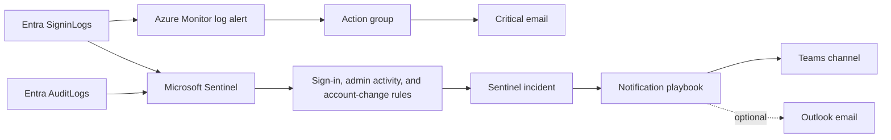

# Alerting and notifications

[Back to the quickstart](../README.md)

Alerting is optional because Entra logs must already be routed to Log Analytics. The first-run wizard explains the prerequisites and can save alerting for later.

## Notification architecture

## Azure Monitor email

This path creates a severity-0 scheduled-query alert and an email action group. Every five minutes it searches for successful and failed sign-in records belonging to either emergency account. Failed attempts are included because they can reveal misuse even when authentication is blocked.

Required inputs:

- existing Log Analytics workspace receiving this tenant's `SigninLogs`;
- one notification email address.

The alert is stateless, so later activity can notify again rather than remaining hidden behind an unresolved alert.

## Sentinel detections

The optional Sentinel component creates high-severity detections for:

- successful or failed emergency-account sign-ins;
- directory or administrative activity performed by either account;
- changes made to either emergency-account object.

It requires an existing Sentinel-enabled workspace receiving `SigninLogs` and `AuditLogs` in the Analytics tier. The workspace can be in another subscription in the same tenant.

The notification playbook identity receives Microsoft Sentinel Reader on the workspace. The Azure Security Insights service principal requires Microsoft Sentinel Automation Contributor on the playbook resource group so the automation rule can invoke it. The deployment assigns both roles and records their exact IDs for cleanup.

## Teams delivery

The recommended `admin-configured` experience is designed for a first-time administrator:

1. Copy the target channel link in Microsoft Teams.
2. Paste it into the wizard.
3. Complete the single browser authorization URL printed after deployment.
4. Return to the terminal so the deployment can verify the connection and enable the playbook.

Use a dedicated automation account as the connection owner and assign durable operational owners. User OAuth is required only for the Teams connector authorization; the incident trigger itself uses managed identity.

Advanced alternatives:

- `workflow-webhook`: simple runtime delivery without a user token, but the callback URL is a bearer secret and the Teams Workflow still has an owner lifecycle;
- `api-connection`: reuse an existing authorized Teams Logic Apps connection and supply explicit team/channel IDs;
- proactive Teams bot: application identity at runtime, but requires hosting, tenant app approval, installation, and conversation-reference management.

Direct Microsoft Graph application posting to ordinary Teams channels is not a supported shortcut; its application permission is limited to migration scenarios.

## Optional playbook email

Sentinel notifications can also use an existing authorized Office 365 Outlook Logic Apps connection. This is separate from the simpler Azure Monitor action-group email and has a delegated connection-owner lifecycle.

For application-only branded email, consider Azure Communication Services as a separate organization-wide adapter rather than adding it to every deployment.

## Delivery validation and health

Set `AZD_TEST_SENTINEL_NOTIFICATION_DELIVERY=true` after the Teams connection is authorized to post one clearly labeled test message and fail when the real Logic App delivery action does not succeed.

The Sentinel playbooks export `WorkflowRuntime` logs and metrics to existing workspaces. A central operations solution can alert on failed or disabled playbook runs without deploying a polling Function for each environment.

Polling Microsoft Graph is intentionally not the default. Once `SigninLogs` and `AuditLogs` reach Sentinel, polling adds checkpoint, overlap, deduplication, retry, and `AuditLog.Read.All` responsibilities without improving critical detection. Use Event Hub or a polling adapter only for cross-tenant routing, third-party delivery, or custom correlation.
