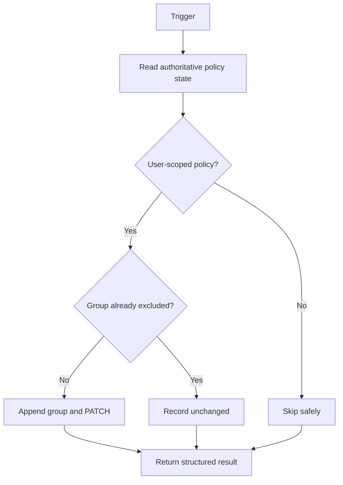

# Conditional Access remediation

[Back to the quickstart](../README.md)

The remediation workload keeps one designated emergency-access group in `conditions.users.excludeGroups` for every user-scoped Conditional Access policy.

## Processing flow

The shared PowerShell core:

- validates every supplied GUID before calling Microsoft Graph;
- follows every Graph page in scheduled modes;
- reads the current policy before changing it;
- preserves and deduplicates every existing exclusion;
- skips policies whose user target is `None`;
- sends PATCH only when the emergency group is absent;
- re-reads the policy immediately before mutation;
- retries bounded 429 and 503 responses using `Retry-After` when Graph supplies it;
- re-reads the policy after mutation and fails unless the exclusion is present;
- continues evaluating other policies after an individual failure;
- returns evaluated, updated, unchanged, and failed counts with policy IDs.

Any PATCH failure causes the invocation to fail after processing, so Azure Functions, Automation, or Logic Apps can surface the problem without leaving other policies unchecked.

Tenant cleanup records each policy from which it removes the owned group. If group deletion later fails while the group still exists, cleanup restores those exclusions and reports the deletion failure instead of leaving the emergency accounts unintentionally exposed to Conditional Access.

## Sentinel targeting

Sentinel mode validates `CAPolicyId` and retrieves only that policy. The default NRT query detects successful Conditional Access policy additions or updates and ignores changes made by the remediation identity to avoid feedback loops.

## Safe verification

Use an approved report-only test policy:

1. Create or update the policy without the emergency group exclusion.
2. Trigger the selected workload or wait for the Sentinel rule.
3. Confirm the group was appended and all prior exclusions remain.
4. Run remediation again and confirm no PATCH is issued.
5. Remove the test policy when the exercise is complete.

Never test by weakening a production policy or using an emergency account for routine administration.
