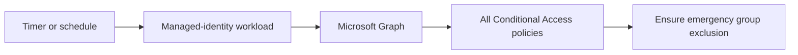
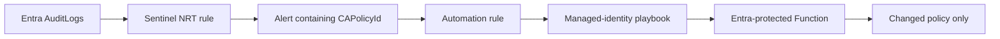

# Deployment modes

[Back to the quickstart](../README.md)

The wizard recommends `function-scheduled` because it is serverless, uses managed identity, and checks every Conditional Access policy on a predictable schedule. Select another mode when it better matches the operating model already used by your organization.

| Mode | Trigger | Behavior | Choose it when |
| --- | --- | --- | --- |
| `function-scheduled` | Azure Functions timer | Checks every policy every six hours by default | You want the recommended general-purpose deployment |
| `automation-scheduled` | Azure Automation schedule | Checks every policy every six hours by default | Your operations team manages PowerShell runbooks |
| `logicapp-scheduled` | Consumption Logic App recurrence | Checks every policy every six hours by default | Your operations team prefers low-code workflows |
| `sentinel-function` | Sentinel NRT analytics and automation rules | Repairs only the policy identified by the alert | Entra `AuditLogs` already flow to Microsoft Sentinel |

An azd environment is locked to its successfully provisioned mode. Run `azd down` before changing modes, or create a separate azd environment. This prevents an old remediator from remaining active after an incremental deployment.

## Scheduled modes

Scheduled modes provide periodic self-healing and do not depend on audit-log ingestion. The default six-hour interval can be changed through the [configuration reference](configuration.md).

## Sentinel-targeted mode

The targeted mode reacts quickly and avoids a full policy sweep. It requires an existing Sentinel-enabled workspace receiving Entra `AuditLogs`. The workspace can be in another subscription in the same tenant.

The playbook invokes the Function with managed identity. App Service Authentication validates the application audience and permits only the playbook principal. No client secret or Function key is created.

## Azure resources

Depending on the selected mode, the deployment creates the workload, managed identities, least-privilege role assignments, operational logging, and supporting storage. Function storage uses identity-based access with shared-key access disabled.

For exact resource definitions, review [`infra/main.bicep`](../infra/main.bicep) and the [`infra/modes`](../infra/modes) folder.
