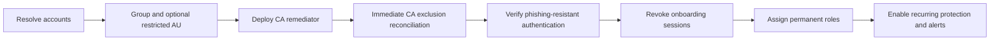

# Identity and authentication

[Back to the quickstart](../README.md)

## Identity choices

The first-run wizard offers three paths:

1. **Create two accounts.** The template creates two cloud-only users, a security group, permanent Global Administrator assignments, and a restricted management administrative unit by default.
2. **Use existing accounts.** The template resolves the supplied UPNs or object IDs, ensures group membership and permanent Global Administrator assignments, and can create the group when it is missing.
3. **Use externally managed accounts.** The template requires exact object IDs and does not modify users, group membership, directory roles, administrative units, or TAP configuration.

For either managed path, you can add an optional third account. It receives permanent **Conditional Access Administrator** and **Authentication Policy Administrator** roles, joins the same protected group and administrative unit, and is included in every alert query. It can recover common Conditional Access and authentication-method policy lockouts with substantially less authority than Global Administrator. It cannot perform general tenant recovery or manage individual users' authentication methods, so it supplements rather than replaces either Global Administrator emergency account.

Before making privileged changes, the template verifies that every managed account is enabled, cloud-only, an internal member, and uses the tenant's `onmicrosoft.com` domain. A supplied group must be a static security group, and a supplied administrative unit must already have restricted management enabled. These checks prevent an ordinary or synchronized administrator identity from being converted accidentally.

The deployment records exact ownership IDs for objects it creates. It refuses to replace an owned privileged object until the original is explicitly cleaned up.

## Required administrator access

The deploying administrator normally needs:

- Azure subscription Contributor plus User Access Administrator, or Owner;
- Global Administrator or Privileged Role Administrator for the emergency-account role assignments;
- permission to grant the delegated Microsoft Graph scopes requested for the selected capabilities;
- access to the existing Log Analytics or Sentinel workspace when alerting is selected.

Activate eligible roles before `azd up`. Azure RBAC does not grant Microsoft Entra or Microsoft Graph privileges.

## Microsoft Graph authentication

Install the authentication module once:

```powershell
Install-Module Microsoft.Graph.Authentication -Scope CurrentUser
```

The first tenant phase calls standard `Connect-MgGraph` once with the complete scope set required by the wizard choices. Windows Account Manager, the current token cache, or a normal browser performs authentication. Later phases use `Connect-MgGraph -NoWelcome` and the same cached context.

If consent is missing, the deployment stops with the missing scopes instead of launching several new prompts. Device-code authentication, client secrets, and Azure CLI Graph tokens are not used.

Runtime workloads use managed identity with `Policy.Read.All`, `Policy.ReadWrite.ConditionalAccess`, and `Application.Read.All`. `Application.Read.All` is included because Conditional Access PATCH currently requires that application permission in addition to the policy permissions.

## Password handling

Microsoft Graph requires an initial password when a user is created. The template generates a cryptographically random value and immediately discards it. It is never printed, returned, stored in azd, written to disk, or placed in Key Vault.

The generated password cannot be recovered. Use TAP onboarding or your approved authentication-method process.

## TAP and passkeys

The wizard requires TAP when it creates identities and recommends it for existing identities. When selected, it:

1. Merges the emergency group into the existing TAP policy targets without replacing other targets.
2. Creates one reusable 60-minute TAP per account so multiple physical security keys can be registered during the same bounded onboarding session.
3. Displays each TAP once in the interactive terminal.
4. Pauses while the custodians register passkeys and verifies at least two device-bound FIDO2 security keys per account through Microsoft Graph.
5. Deletes the temporary passes and revokes all onboarding sessions before assigning permanent administrator roles.

Two physical FIDO2 security keys per account are required to pass the deployment gate. Store them with separate custodians or in separate secure locations. Synced passkeys do not satisfy this gate. TAP values are not generated in noninteractive runs because they cannot be delivered safely.

If TAP is skipped for existing identities, the deployment reads each account's registered FIDO2 methods and applies the same two-device-bound-key gate. There is no typed or environment-variable bypass. The account IDs are fingerprinted after onboarding so normal reruns do not revoke sessions again; every rerun still verifies the security-key invariant before role reconciliation.

The session-revocation operation invalidates Entra refresh tokens. Application session cookies can persist until the application reevaluates them, so close every private onboarding session after passkey registration.

## Provisioning order



The immediate reconciliation fails closed: administrator roles are not assigned if the emergency group cannot first be excluded from a user-scoped Conditional Access policy. The scheduled workload then maintains that invariant.

## Security boundaries

- A restricted management administrative unit reduces routine administrative exposure, but Global Administrators can still manage restricted objects.
- The limited account's role combination can change tenant-wide Conditional Access and authentication-method policy. Treat it as emergency access even though it is less privileged than Global Administrator.
- Conditional Access exclusion preserves recoverability but bypasses the protections represented by those policies.
- Keep accounts cloud-only and separate their credentials, passkeys, devices, and custodians from normal administration.
- Treat every sign-in attempt, successful or failed, as security-relevant.
- Exercise the complete emergency procedure regularly; successful deployment alone does not prove recoverability.
