# Identity and authentication

[Back to the quickstart](../README.md)

## Identity choices

The first-run wizard offers three paths:

1. **Create two accounts.** The template creates two cloud-only users, a security group, permanent Global Administrator assignments, and a restricted management administrative unit by default.
2. **Use existing accounts.** The template resolves the supplied UPNs or object IDs, requires distinct accounts, ensures group membership and permanent Global Administrator assignments, and can create the group when it is missing.
3. **Use externally managed accounts.** The template requires two distinct exact object IDs and does not modify users, group membership, directory roles, administrative units, or TAP configuration. It does resolve the users and group read-only, verifies that the group contains both users, and immediately reconciles its Conditional Access exclusion.

For either managed path, you can add an optional third account. It receives permanent **Conditional Access Administrator** and **Authentication Policy Administrator** roles, joins the same protected group and administrative unit, and is included in every alert query. It can recover common Conditional Access and authentication-method policy lockouts with substantially less authority than Global Administrator. It cannot perform general tenant recovery or manage individual users' authentication methods, so it supplements rather than replaces either Global Administrator emergency account.

Before making privileged changes, the template verifies that every account is distinct, enabled, cloud-only, an internal member, and uses the tenant's `onmicrosoft.com` domain. A supplied group must be a static security group, and a supplied administrative unit must already have restricted management enabled. These checks prevent an ordinary or synchronized administrator identity from being converted accidentally.

When a supplied group already has additional members, setup never removes them or fails merely because they exist. It enumerates them, warns that every member receives the Conditional Access exclusion, records the member count, and requires explicit adoption of the exact membership fingerprint. A later membership change requires a new acknowledgement. Use a dedicated group; adoption is migration support, not an endorsement of unrelated members.

The deployment records exact ownership IDs for objects it creates. It refuses to replace an owned privileged object until the original is explicitly cleaned up.

## Required administrator access

Global Administrator is the simplest end-to-end deploying role. A least-privilege operator instead needs the complete combination required by the selected operations, including:

- Azure subscription Contributor plus User Access Administrator, or Owner;
- User Administrator for managed account and group preparation;
- Privileged Role Administrator for permanent directory-role assignments;
- Conditional Access Administrator for immediate policy reconciliation;
- Authentication Policy Administrator when TAP policy targeting is changed;
- Authentication Administrator for authentication-method operations on nonadministrators, or Privileged Authentication Administrator when an existing emergency account is already privileged;
- permission to grant the delegated Microsoft Graph scopes requested for the selected capabilities;
- access to the existing Log Analytics or Sentinel workspace when alerting is selected.

Activate eligible roles before `azd up`. Azure RBAC does not grant Microsoft Entra or Microsoft Graph privileges.

## Microsoft Graph authentication

Install the authentication module once:

```powershell
Install-Module Microsoft.Graph.Authentication -Scope CurrentUser
```

The first tenant phase calculates the complete scope set required by the wizard choices and passes it once to the shared `graph-delegated-authentication` component. A delegated `CurrentUser` context is reused only when its tenant, Microsoft Graph cloud, administrator account, and scopes match and a harmless user read succeeds. If authentication is actually required, Microsoft Graph PowerShell uses its secured cache, Windows broker, or a normal browser. Later lifecycle phases run the same proof and normally reuse that context without another sign-in.

Managed-account setup requests user, group, role-management, Conditional Access, session-revocation, and passkey-policy permissions. TAP additionally requires authentication-method policy and user authentication-method write permissions. External mode requests only the user/group reads needed to prove the supplied objects plus the workload permissions.

If an interactive deployment changes choices, the next run can request the new complete scope set in one normal broker/browser operation. A noninteractive run fails with the exact missing context properties instead of opening authentication. Device-code authentication, client secrets, and Azure CLI Graph tokens are not used.

When Azure CLI uses workload identity federation, set the delegated administrator identity explicitly before the controller establishes the compatible persisted Graph context:

```powershell
azd env set AZD_GRAPH_OPERATOR_UPN 'admin@contoso.example'
```

For an interactive Azure CLI user, the account is derived automatically and an explicit value must match it. The component never disconnects an inherited session; interactive lifecycle hooks explicitly authorize replacing a mismatched context with the Azure-selected administrator.

The exact component revision and hashes are recorded in `azd-components.lock.json`. Update it from `azd-reference`; do not edit `scripts/vendor/Azd.GraphAuthentication` locally.

Runtime workloads use managed identity with `Policy.Read.All`, `Policy.ReadWrite.ConditionalAccess`, and `Application.Read.All`. `Application.Read.All` is included because Conditional Access PATCH currently requires that application permission in addition to the policy permissions.

## Password handling

Microsoft Graph requires an initial password when a user is created. The template generates a cryptographically random value and immediately discards it. It is never printed, returned, stored in azd, written to disk, or placed in Key Vault.

The generated password cannot be recovered. Use TAP onboarding or your approved authentication-method process.

## TAP and passkeys

The wizard requires TAP when it creates identities and recommends it for existing identities. When selected, it:

1. Merges the emergency group into the existing TAP policy targets without replacing other targets.
2. Fails before issuing a pass if the tenant TAP policy requires one-time passes or does not permit a 60-minute lifetime. It never silently relaxes those tenant-wide controls.
3. Creates one reusable 60-minute TAP per account so multiple physical security keys can be registered during the same bounded onboarding session.
4. Displays each TAP once in the interactive terminal.
5. Pauses while the custodians register passkeys and verifies at least two device-bound FIDO2 security keys per account through Microsoft Graph.
6. Deletes the temporary passes and revokes all onboarding sessions.
7. During interactive setup, requires a sign-in drill with each physical key, then revokes the drill sessions before assigning permanent administrator roles.

The passkey policy must be enabled and directly target all users or the emergency group without excluding the accounts directly or through another group. Two registered device-bound FIDO2 methods permitted by the applicable passkey profile are required to pass the deployment gate. Store the physical keys with separate custodians or in separate secure locations. Synced passkeys do not satisfy this gate. Registration data cannot prove that two records represent working, separately stored devices, which is why the operator drill is required. TAP values are not generated in noninteractive runs because they cannot be delivered safely.

If TAP is skipped for existing identities, the deployment reads each account's registered FIDO2 methods and applies the same two-device-bound-key gate. There is no typed or environment-variable bypass for the Graph gate. Onboarding and the exact tested key set are fingerprinted separately, so normal reruns do not repeat TAP issuance or a confirmed drill; replacing a key invalidates the drill record. Every rerun still verifies policy targeting, transitive exclusions, effective passkey-profile restrictions, and the permitted security-key count before role reconciliation. Noninteractive setup cannot perform the operator drill and emits a prominent warning. Complete the drill through a later interactive `azd hooks run postprovision`; that run revokes the drill sessions and records completion before the deployment is treated as operational.

The session-revocation operation invalidates Entra refresh tokens. Application session cookies can persist until the application reevaluates them, so close every private onboarding session after passkey registration.

## Provisioning order

```mermaid
flowchart LR
  A[Resolve accounts] --> B[Group and optional restricted AU]
  B --> C[Deploy CA remediator]
  C --> D[Immediate CA exclusion reconciliation]
  D --> E[Verify phishing-resistant authentication]
  E --> F[Revoke onboarding sessions]
  F --> G[Test each physical key]
  G --> H[Revoke drill sessions]
  H --> I[Assign permanent roles]
  I --> J[Enable recurring protection and alerts]
```



The immediate reconciliation fails closed: administrator roles are not assigned if the emergency group cannot first be excluded from a user-scoped Conditional Access policy. The scheduled workload then maintains that invariant.

## Security boundaries

- A restricted management administrative unit reduces routine administrative exposure, but Global Administrators can still manage restricted objects.
- The limited account's role combination can change tenant-wide Conditional Access and authentication-method policy. Treat it as emergency access even though it is less privileged than Global Administrator.
- Conditional Access exclusion preserves recoverability but bypasses the protections represented by those policies.
- Keep accounts cloud-only and separate their credentials, passkeys, devices, and custodians from normal administration.
- Treat every sign-in attempt, successful or failed, as security-relevant.
- Exercise the complete emergency procedure regularly; successful deployment alone does not prove recoverability.
